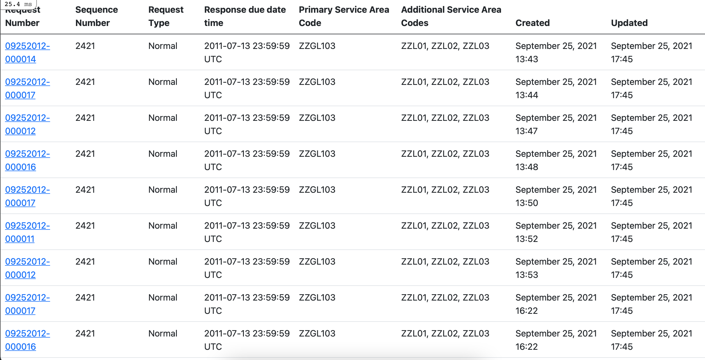
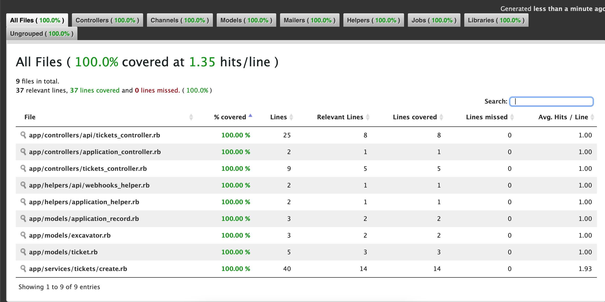

## Setup

Copy test `.env` and update `DATABASE_URL`

`cp .env.example .env.development`
`cp .env.example .env.test`

Install libs and dependencies

`bundle install`
and
`yarn install`

Run migrates

`bundle exec rake db:migrate`

Run server

`bundle exec rails s`

## API endpoints

```
/api/tickets.json
```

For sample `api/tickets` endpoint request data, please take a look `db/samples/ticket.json`.

## Example API Calls

```bash
curl -X POST -H "Content-Type: application/json" -d @db/samples/ticket.json http://localhost:3000/api/tickets
```

## Example API Response

```json
{
  "data": {
    "type": "Ticket",
    "id": "39",
    "attributes": {
      "request_number": "09252012-00001",
      "sequence_number": "2421",
      "request_type": "Normal",
      "response_due_date_time": "2011-07-13T23:59:59.000Z",
      "primary_service_area_code": "ZZGL103",
      "additional_service_area_codes": [
        "ZZL01",
        "ZZL02",
        "ZZL03"
      ],
      "digsite_info_well_known_text": null,
      "excavator": {
        "company_name": "John Doe CONSTRUCTION",
        "address": "555 Some RD",
        "crew_on_site": null
      }
    },
    "meta": {
      "created_at": "2021-09-25T17:15:52Z",
      "updated_at": "2021-09-25T17:15:52Z"
    }
  }
}
```

## List of tickets



## Simplecov

